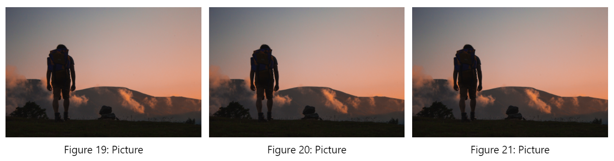

# Markender

Do you love using markdown? Do you wish you could use it for reports? With Markender you can!

It includes everything you need to create an amazing report:
 - Cover-pages
 - Table of contents
 - Formulas
 - Checklists
 - Image-referencing
 - Bibliography

Style it just the way you want with the following built in styles:
 - Latex
 - Dropbox
 - Github
 - Somnox
 - ACM (work in progress)


# All Components
By using [web-components](https://developer.mozilla.org/en-US/docs/Web/Web_Components) we make additions easy and simple. Furthermore, if one does not have the extension, they see nothing! The following web components are defined and can be used within vscode:

## Cover Page
`<md-cover></md-cover>` will create a cover page at the place you put it.

The following properties are available to customize the component:

| Property | Description          |
|----------|----------------------|
| title    | Title of the report  |
| author   | Author of the report |

## Table of contents
`<md-toc></md-toc>` will create a new chapter and the bibliography.

| Property | Description                                                     |
|----------|-----------------------------------------------------------------|
| chapters | Flag to display chapter numbers before chapters (true or false) |

## Referencing
Basic markdown does not implement referencing. This is why markdown implements its own form of referencing. One can reference items by using the `[reference]` notation. You can combine references by splitting them with a comma: `[reference1, reference2]`

### Bibliography
`<md-bib></md-bib>` will create the bibliography.

| Property | Description                                           |
|----------|-------------------------------------------------------|
| src      | Source of the bibliography (this should be in [bibtex](http://www.bibtex.org/Format/) format) |
| format   | How to format the references (default: {refnumber}) |

For the loading of the bibliography and doi-references you need to disable security with `Markdown: Change Preview Security Settings`
The citation key is shown between brackets, to help you quickly find that reference. It will automatically be removed when converting to pdf.

The format property of the `md-bib` element will say how the element will display its reference. For example `format="Hello World"` will make all reference have the form of `[Hello World]`. Within this format you can use a few variables. These are notated in the form of `{variableName}`. The following can be used within formatting:
 - `{refnumber}`: Will display the reference number of the item
 - `{authors}`: Will show all authors
 - `{author}`: Will try to show only the first author and add `et al.` if there are more than one.
 - `{year}`: The year when the item was published. For `md-bib-url` this is the current year.

### Reference from doi
`<md-bib-doi>${doi}</md-bib-doi>` will tell the bibliography to get a reference from the given doi.

| Property | Description                                           |
|----------|-------------------------------------------------------|
| id       | The citation key of the reference                     |

Example:

```
<md-bib>
    <md-bib-doi>10.1109/5.771073</md-bib-doi>
</md-bib>
```

### Reference from url
`<md-bib-url>${url}</md-bib-url>` will tell the bibliography to get a reference from the given url.

| Property | Description                                           |
|----------|-------------------------------------------------------|
| id       | The citation key of the reference                     |
| accessed | The date of when the reference was accessed in the form `year-month-day` |

Example:

```
<md-bib>
    <md-bib-url>https://github.com/mjwsteenbergen/markender</md-bib-url>
</md-bib>
```

## Images
By default any image (``) is converted to a `<md-img></md-img>` element.

However, there might be a few cases, where it would be useful to use the element alone.

| Property | Description                                           |
|----------|-------------------------------------------------------|
| src      | Source of the image                                   |
| alt      | Description of the image that is displayed below      |
| id       | How to reference the figure using the \[ref\] format  |
| size     | add the words: `full,medium,small or super-small` to change the size of the image like so: `<md-img small></md-img>`  |

### Collages

Markdown does not contain a specification to have images on the same line. This extension adds this functionality


Example:

in markdown:

```html
<ul collage>
    <md-img src='https://images.unsplash.com/reserve/91JuTaUSKaMh2yjB1C4A_IMG_9284.jpg' alt='Picture'></md-img>
    <md-img src='https://images.unsplash.com/reserve/91JuTaUSKaMh2yjB1C4A_IMG_9284.jpg' alt='Picture'></md-img>
    <md-img src='https://images.unsplash.com/reserve/91JuTaUSKaMh2yjB1C4A_IMG_9284.jpg' alt='Picture'></md-img>
</ul>
```

## Style
`<md-style></md-style>` will add css styling to the page to make it look amazing.

| Property | Description                |
|----------|----------------------------|
| name     | The style it should assume |
| margin   | Margin of the printed page |
| url      | The url of your personal sheet |

The property name can have the values shown when using the snippet `style` within markdown. Append the `name` property with `disable_style` to disable the style used by vscode and show the text as it will be printed.

margin can have one value (top, bottom, left, right), two ((top, bottom), (left, right)) or four (top, right, bottom, left)

url will get the contents of the stylesheet and set add it to the document. This will also disable the margin property, so if wanted needs to be set in the stylesheet.

## Extra functionality

Formula's with latex-math syntax can be used by using double dollar signs. For all possibilties look at [this resource](https://en.wikibooks.org/wiki/LaTeX/Mathematics). 

Example:
```
$$\forall x \in X, \quad \exists y \leq \epsilon$$
```

Todos can be used by using the following syntax:

```
 - [ ] Open todo
 - [X] Completed todo
```

## Convert your document to PDF

You can use [Markdown Converter](https://marketplace.visualstudio.com/items?itemName=manuth.markdown-converter) to convert your document to pdf!

Make sure to use the following settings to make it very pretty:

```
    "markdownConverter.Document.HeaderFooterEnabled": false,
    "markdownConverter.Document.Paper.Margin": { "Top": "0", "Bottom": "0", "Left": "0", "Right": "0"}
```

## Release Notes

### 1.3.0
 - Multiple references at once!
 - You can now reference anything that BibTex can!
 - More options to format your references

### 1.2.0
- Combine vscode styles and document styles
- Show citation key in bibliography

### 1.1.0
- Move css to actual css files
- Remove css from ts components
- Improve acm

### 1.0.1
Improve documentation

### 1.0.0
Initial Release!
