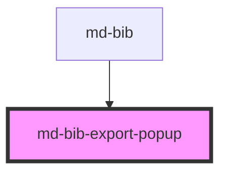

# md-bib-export-popup
<!-- EXCLUDE IN README -->

<!-- Auto Generated Below -->

## Properties

| Property | Attribute | Description | Type            | Default     |
| -------- | --------- | ----------- | --------------- | ----------- |
| `bib`    | --        |             | `BibtexEntry[]` | `undefined` |

## Events

| Event         | Description | Type               |
| ------------- | ----------- | ------------------ |
| `shouldClose` |             | `CustomEvent<any>` |

## Dependencies

### Used by

 - [md-bib](../md-bib)

### Graph

----------------------------------------------

*Built with [StencilJS](https://stenciljs.com/)*
