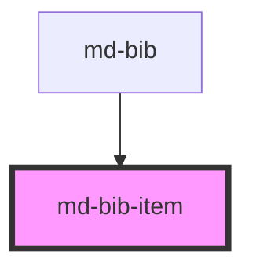

# md-bib-item

<!-- Auto Generated Below -->

## Properties

| Property  | Attribute | Description | Type          | Default     |
| --------- | --------- | ----------- | ------------- | ----------- |
| `bibitem` | --        |             | `BibtexEntry` | `undefined` |
| `name`    | `name`    |             | `string`      | `undefined` |

## Dependencies

### Used by

 - [md-bib](../md-bib)

### Graph

 

*Built with [StencilJS](https://stenciljs.com/)*
