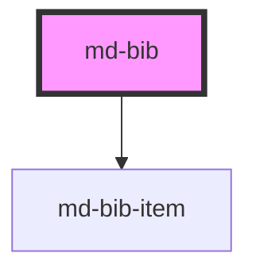

# md-bib
For the loading of the bibliography and doi-references you need to disable security with `Markdown: Change Preview Security Settings`
The citation key is shown between brackets, to help you quickly find that reference. It will automatically be removed when converting to pdf.

The format property of the `md-bib` element will say how the element will display its reference. For example `format="Hello World"` will make all reference have the form of `[Hello World]`. Within this format you can use a few variables. These are notated in the form of `{variableName}`. The following can be used within formatting:
 - `{refnumber}`: Will display the reference number of the item
 - `{authors}`: Will show all authors
 - `{author}`: Will try to show only the first author and add `et al.` if there are more than one.
 - `{year}`: The year when the item was published. For `md-bib-url` this is the current year.

### Reference from doi
`<md-bib-doi>${doi}</md-bib-doi>` will tell the bibliography to get a reference from the given doi.

| Property | Description                                           |
|----------| ---------|
| id       | The citation key of the reference                     |

Example:

```
<md-bib>
    <md-bib-doi>10.1109/5.771073</md-bib-doi>
</md-bib>
```

### Reference from url
`<md-bib-url>${url}</md-bib-url>` will tell the bibliography to get a reference from the given url.

| Property | Description                                           |
|----------| ---------|
| id       | The citation key of the reference                     |
| accessed | The date of when the reference was accessed in the form `year-month-day` |

Example:

```
<md-bib>
    <md-bib-url>https://github.com/mjwsteenbergen/markender</md-bib-url>
</md-bib>
```

<!-- Auto Generated Below -->


## Properties

| Property | Attribute | Description                                                                                   | Type     | Default         |
| -------- | --------- | --------------------------------------------------------------------------------------------- | -------- | --------------- |
| `format` | `format`  | How to format the references)                                                                 | `string` | `"{refnumber}"` |
| `src`    | `src`     | Source of the bibliography (this should be in [bibtex](http://www.bibtex.org/Format/) format) | `string` | `undefined`     |


## Dependencies

### Depends on

- [md-bib-item](../md-bib-item)

### Graph


----------------------------------------------

*Built with [StencilJS](https://stenciljs.com/)*
