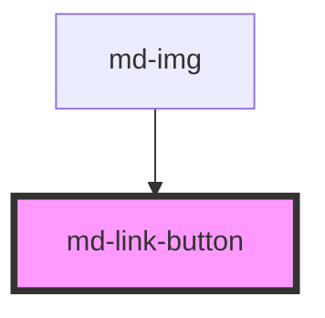

# md-link-button
<!-- EXCLUDE IN README -->

<!-- Auto Generated Below -->

## Properties

| Property | Attribute | Description                                     | Type     | Default     |
| -------- | --------- | ----------------------------------------------- | -------- | ----------- |
| `link`   | `link`    | Flag to display chapter numbers before chapters | `string` | `undefined` |

## Dependencies

### Used by

 - [md-img](../md-img)

### Graph

----------------------------------------------

*Built with [StencilJS](https://stenciljs.com/)*
