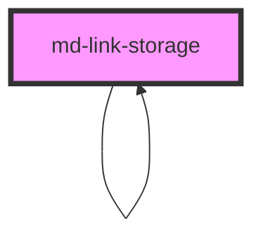

# md-link-storage

<!-- Auto Generated Below -->

## Methods

### `subscribe(id: string, element: LinkSubscriber) => Promise<void>`

#### Returns

Type: `Promise<void>`

### `update(id: string, link: Link) => Promise<void>`

#### Returns

Type: `Promise<void>`

### `updateLinkSubscribers(id: string, link: Link) => Promise<void>`

#### Returns

Type: `Promise<void>`

## Dependencies

### Used by

 - [md-link-storage]()

### Depends on

- [md-link-storage]()

### Graph

----------------------------------------------

*Built with [StencilJS](https://stenciljs.com/)*
