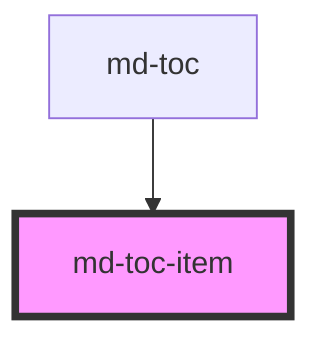

# md-toc-item
<!-- EXCLUDE IN README -->

<!-- Auto Generated Below -->

## Properties

| Property  | Attribute | Description | Type     | Default     |
| --------- | --------- | ----------- | -------- | ----------- |
| `chapter` | `chapter` |             | `string` | `undefined` |
| `indent`  | `indent`  |             | `string` | `undefined` |
| `name`    | `name`    |             | `string` | `""`        |

## Dependencies

### Used by

 - [md-toc](../md-toc)

### Graph

 

*Built with [StencilJS](https://stenciljs.com/)*
