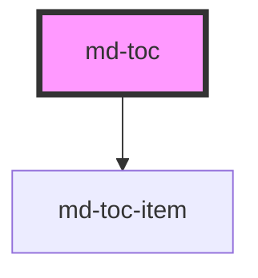

# md-toc
`<md-toc></md-toc>` will create a new chapter and the bibliography.

When a table of contents element exists, chapters can be referenced by either writing the name of the chapter between brackets: `[name of chapter]`. However, it might be that this chapter name is a duplicate. In this case, you can use the id of the chapter `[name-of-chapter-1]`

<!-- Auto Generated Below -->

## Properties

| Property   | Attribute  | Description                                     | Type      | Default |
| ---------- | ---------- | ----------------------------------------------- | --------- | ------- |
| `chapters` | `chapters` | Flag to display chapter numbers before chapters | `boolean` | `true`  |

## Dependencies

### Depends on

- [md-toc-item](../md-toc-item)

### Graph

----------------------------------------------

*Built with [StencilJS](https://stenciljs.com/)*
