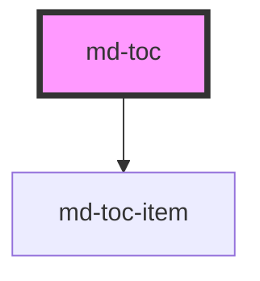

# md-toc
`<md-toc></md-toc>` will create a new chapter and the bibliography.

<!-- Auto Generated Below -->

## Properties

| Property   | Attribute  | Description                                     | Type      | Default |
| ---------- | ---------- |  - | --------- | ------- |
| `chapters` | `chapters` | Flag to display chapter numbers before chapters | `boolean` | `true`  |

## Dependencies

### Depends on

- [md-toc-item](../md-toc-item)

### Graph

 

*Built with [StencilJS](https://stenciljs.com/)*
